## Recap: causal questions

- questions of *association* are of the kind:
  - what is the probability of $Y$ (potentially: after observing $X$)?, for example:
    - what is the chance of rain tomorrow given that is was dry today?
    - what is the chance a patient with lung cancer lives more than 10% after diagnosis?
  - these *hands behind your back and passively observe the world*-questions
- *causal* questions are of the kind:
  - how would $Y$ change when we intervene on $T$?, e.g.:
    - if we would send all pregant women to the hospital for delivery, what would happen with neonatal outcomes?
    - if we start a marketing campain, by how much would our revenue increase?
  - these tell us what would happen if we changed something

# What is prediction? How does it compare to causal inference?

## Examples of prediction tasks

observe an $X$, want to know what to expect for $Y$

[1. X = patient coughs, Y = patient has lung cancer]{.fragment fragment-index=1}

[2. X = ECG, Y = patient has heart attack]{.fragment fragment-index=2}

[3. X = CT-scan, Y = patient dies within 2 years]{.fragment fragment-index=3}

::::{.r-stack}

:::{.fragment .fade-in-then-out fragment-index=2}
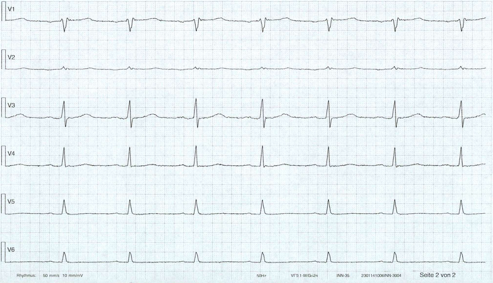{height=400}
:::

:::{.fragment .fade-in-then-out fragment-index=3}
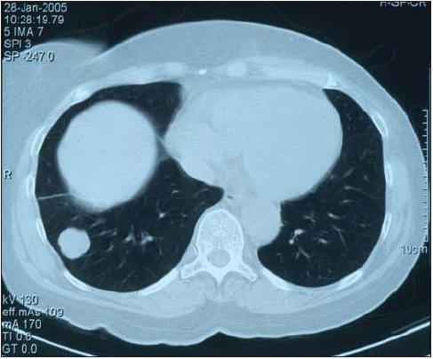{height=400}
:::

::::

## Prediction: typical approach

1. define population, find a cohort
2. measure $X$ at *prediction baseline*
3. measure $Y$
   a. cross-sectional (e.g. diagnosis)
   b. longitudinal follow-up (e.g. survival)
4. use a statistical learning technique (e.g. regression, machine learning)
  - fit model $f$ to observed $\{x_i,y_i\}$ with a criterion / loss function
5. evaluate prediction performance with e.g. discrimination, calibration, $R^2$

## Prediction: typical estimand

Let $f$ depend on parameter $\theta$, prediction typically aims for:

$$f_{\theta}(x) \to E[Y|X=x]$$

- when $Y$ is binary:
  - probability of a heart attack in 10 years, given age and cholesterol
  - probability of lung cancer, given symptoms and CT-scan
  - typical evaluation metrics:
    - discrimination: sensitivity, specificity, AUC
    - calibration

## Causal inference: typical approach

1. define target population and targeted treatment comparison
2. run randomized controlled trial, randomizing treatment allocation (when possible)
3. measure patient outcomes
4. estimate parameter that summarizes *average treatment effect* (ATE)

:::{.fragment}

typical estimand:

$$E[Y|\text{do}(T=1)] - E[Y|\text{do}(T=0)]$$

:::

## Causal inference versus prediction

:::{.columns}

::::{.column width="50%"}

prediction

- typical estimand $E[Y|X]$
- typical study: longitudinal cohort
- typical interpretation: $X$ predicts $Y$
- primary use: know what $Y$ to expect when observing a new $X$ *assuming no change in joint distribution*

::::

::::{.column width="50%"}

causal inference

- typical estimand $E[Y|\text{do}(T=1)] - E[Y|\text{do}(T=0)]$
- typical study: RCT (or observational causal inference study)
- typical interpretation: *causal effect* of $T$ on $Y$
- primary use: know what change in $Y$ to expect when *setting the treatment policy*

::::

:::

## Where can prediction and causality meet?

1. prediction has a causal interpretation
2. prediction may or may not have a causal interpretation:
   a. but is used for a causal task (e.g. treatment decision making)
   b. but predictions can be improved with causal thinking in terms of e.g.:
     - interpretability, robustness, 'spurious correlations', generalization, fairness, selection bias

# 1. Prediction has a causal interpretation

## What can we mean with predictions having a causal interpretation?

Let $f: \mathbb{X} \to \mathbb{Y}$ be a prediction model for outcome $Y$ using features $X$

::::{layout-ncol=2}

:::::{.column}

1. $X$ is an ancestor of $Y$ ($X=\{z_1,z_2,z_3\}$)
2. $X$ is a direct cause of $Y$ ($X=\{z_1,z_2\}$)
3. $f: \mathbb{X} \to \mathbb{Y}$ describes the causal effect of $X$ on $Y$ ($X=\{z_1\}$), i.e.: 

:::{.fragment}

$$f(x) = E[Y|\text{do}(X=x)]$$

:::

4. $f: \mathbb{T} \times \mathbb{X} \to \mathbb{Y}$ describes the causal effect of $T$ on $Y$ conditional on $X$ ($T=\{z_1\},X=\{z_2,z_3,w\}$):
   
:::{.fragment}

$$f(t,x) = E[Y|\text{do}(T=t),X=x]$$

:::

:::::
 
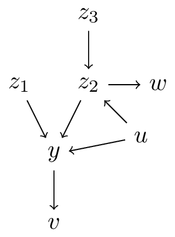

::::

## interpretation 3. all covariates are *causal*

Let $f: \mathbb{X} \to \mathbb{Y}$ be a prediction model for outcome $Y$ using features $X$

$$f(x) = E[Y|\text{do}(X=x)]$$

- the requirements for this interpretation are very hard to satisfy (i.e. back-door rule holds for **all** variables)
- too often this is assumed / interpreted this way (*table 2 fallacy* in health care literature)

## Example of table 2 fallacy when mis-using Qrisk

[Qrisk3](https://www.qrisk.org): a risk prediction model for cardiovascular events in the coming 10-years.
Widely used in the United Kingdom for deciding which patients should get statins

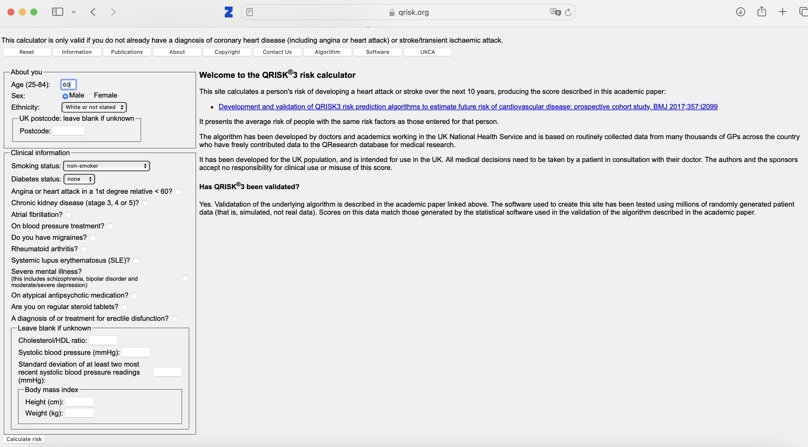

## Qrisk3 - risks:

can go wrong when:

- e.g. fill in current length and weight
    - reduce weight by 5 kgs
    - interpret difference as 'effect of weight loss'
- check or un-check blood pressure medication
  - observe that with blood pressure medication, risk is higher

<!-- ## What else could go wrong?

- Qrisk3 states it is validated, but validated for what?
- Qrisk3 is validated for non-use! -->

## interpretation 4. some covariates are *causal* 

### or: prediction-under-intervention

$$f(t,x) = E[Y|\text{do}(T=t),X=x]$$

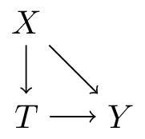{height=500}

- interpretation: *what is the expected value of $Y$ if we were to assign treatment $t$ by intervention, given that we know $X=x$ in this patient*

<!-- --- 

:::{.columns}

::::{.column width="50%"}

using *treatment naive* prediction models for decision support

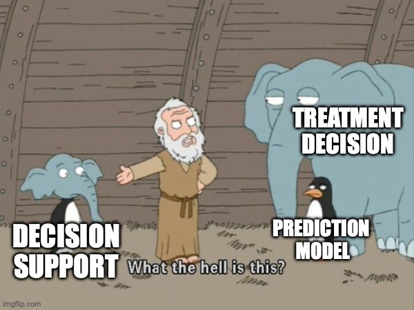{fig-align="center"}

::::

::::{.column width="50%"}

prediction-under-intervention

{.fragment fig-align="center"}

::::
::: -->

## Estimand for prediction-under-intervention models

What is the estimand?

- prediction: $E[Y|X]$
- average treatment effect: $E[Y|\text{do}(T=1)] - E[Y|\text{do}(T=0)]$
- conditional average treatment effect: $E[Y|\text{do}(T=1),X] - E[Y|\text{do}(T=0),X]$
- prediction-under-intervention: $E[Y|\text{do}(T=t),X]$

[note:]{.fragment}

- from prediction-under-intervention models, the CATE can be derived
- in these models and the CATE: $T$ has a causal interpretation, $X$ does not!
  - i.e. $X$ does not *cause* the effect of treatment to be different

## Developing prediction-under-intervention models

- requires causal inference assumptions or RCTs
- single RCTs often not big enough, or did not measure the right $X$s
- when $X$ is not a sufficient adjustment set, but $X+L$ is, can adjust additionally for $L$ using e.g. propensity score methods or standardization
- assumption of no unobserved confounding often hard to justify in observational data
- but there's more between heaven (RCT) and earth (confounder adjustment)

  :::{.nonincremental}
  - proxy-variable methods [e.g. @miaoIdentifyingCausalEffects2018;@vanamsterdamIndividualTreatmentEffect2022]
  - constant relative treatment effect assumption [e.g. @alaaMachineLearningGuide2021; @vanamsterdamConditionalAverageTreatment2023; @candidodosreisUpdatedPREDICTBreast2017]
  - diff-in-diff
  - instrumental variable analysis [@waldFittingStraightLines1940; @puliGeneralControlFunctions2021;@hartfordDeepIVFlexible2017]
  - front-door analysis

  :::

- not covered now: formulating correct estimands (and getting the right data) becomes much more complicated when considering dynamic treatment decision processes (e.g. blood pressure control with multiple follow-up visits) [@luijkenRiskBasedDecisionMaking2024]

## Evaluating predictive performance of prediction-under-intervention models

- Estimand for prediction-under-intervention: expected outcome under intervention, conditional on covariates $X$
- prediction accuracy can be tested in RCTs, this **is** the target distribution
- or in observational data with specialized methods accounting for confounding (e.g. [@boyerEstimatingEvaluatingCounterfactual2025; @keoghPredictionInterventionsEvaluation2024])
  -  remember from Day 2: observational causal inference is using data we have and assumptions to make inferences about a setting on which we do not have data
- in confounded observational data, typical metrics (e.g. AUC or calibration) are not sufficient as we want to predict well in data from *other distribution than observed data* (i.e. other treatment decisions)
-  evaluation approaches based on confounder adjustment methods:
    -  IPW reweighting
    -  confounder adjustment / standardization
    -  doubly robust methods

# 2a. (Prediction) models used for a causal task (decision making)

<!-- --- 

{fig-align="center"} -->

## Using prediction models for decision making is often thought of as a good idea

For example:

1. give chemotherapy to cancer patients with high predicted risk of recurrence
2. give statins to patients with a high risk of a heart attack

. . . 

::: {.callout-note icon=false}
## TRIPOD+AI on prediction models [@collinsTRIPODAIStatement2024]

“Their primary use is to support clinical decision making, such as ... **initiate treatment or lifestyle changes.**” 

:::

- in abstract terms: prediction model $f$ induces a new treatment policy

## What do we mean with treatment policy?

A treatment policy $\pi$ is a procedure for determining the treatment

Assuming $T$ is binary, $\pi$ can be:

- $\pi = 0.5$ (a 1/1 RCT)
- deterministic guideline, e.g. give blood pressure pill to patients with hypertension:

[$$\pi(\text{blood pressure}) = \begin{cases}
  1, &\text{blood pressure} > 140\text{mmHg}\\
  0, &\text{otherwise}
  \end{cases}$$]{.fragment}

- **dependent on prediction models**: give statins to patients with more than 10% predicted risk of heart attack; take $f(X)$ as a prediction model for the risk of heart attack:

[$$\pi(X) = \begin{cases}
  1, &f(X) > 0.1\\
  0, &\text{otherwise}
  \end{cases}$$]{.fragment}

- the propensity score is an estimate of the current treatment policy, conditional on features $X$:

[$$\pi_0(X) = P(T=1|X)$$]{.fragment}

## Let's think about old and new treatment policies

:::{.r-stack}

{.fragment width="100%"}

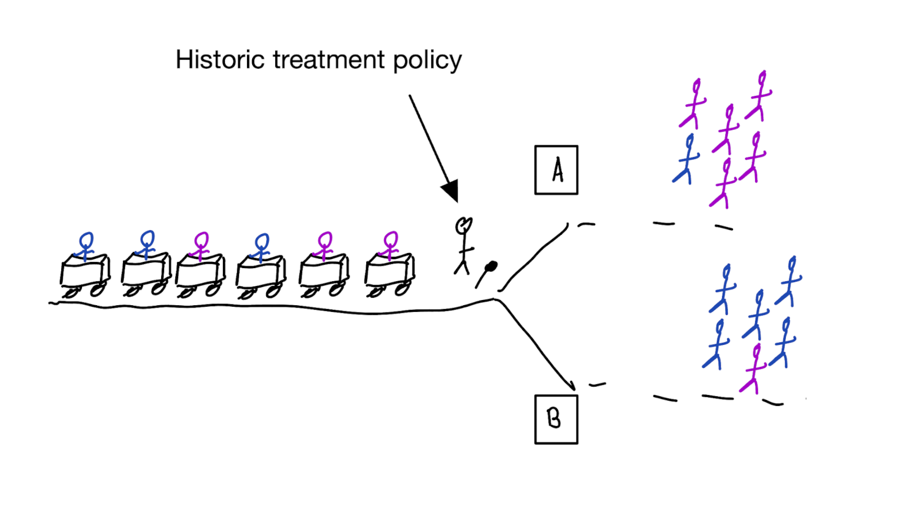{.fragment width="100%"}

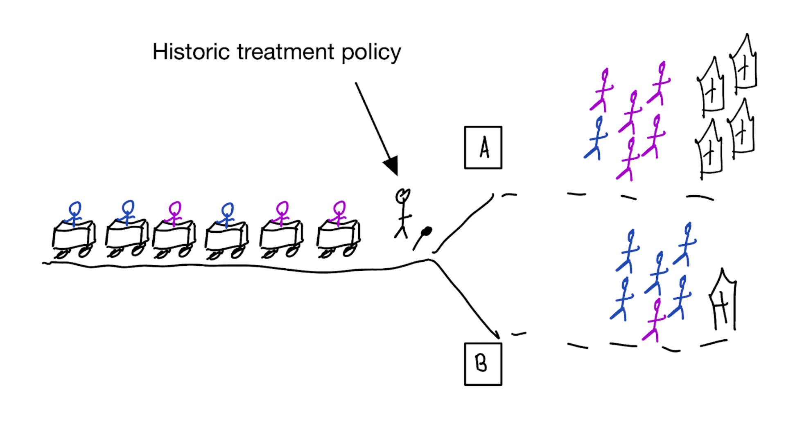{.fragment width="100%"}

:::

## Model deployment is an intervention, changing treatments and outcomes

:::{.r-stack}

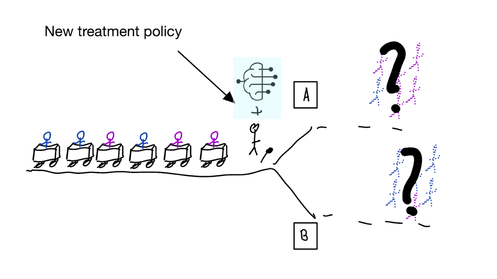

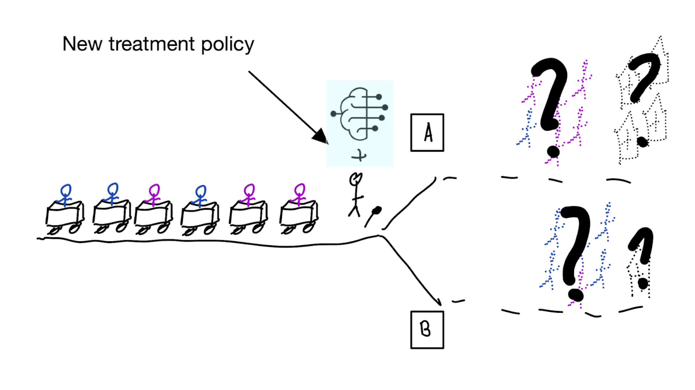{.fragment width="100%"}

:::

## How do we learn about the effect of an intervention?

With causal inference!

- for using a decision support model, the unit of intervention is the decision maker, typically *a healthcare provider*
- randomly assign *providers* to have access to the model or not
- measure differences in **treatment decisions** and **patient outcomes**
- this called a cluster RCT: outcomes on patient level, who clustered within randomized units (e.g. healthcare providers, hospitals, schools, etc.)
- if using model improves outcomes, use that one

. . . 

:::{.callout-tip icon="false"}

## Using cluster RCTs to evaluated models for decision making is not a new idea [@cooperEvaluationMachinelearningMethods1997]

“As one possibility, suppose that a trial is performed in which clinicians are randomized either to have or not to have access to such a decision aid in making decisions about where to treat patients who present with pneumonia.” 

:::

. . .

:::{.callout-warning}
## What we don't learn
was the model predicting anything sensible?
:::

## What if we cannot do this (cluster randomized) trial?{#sec-policyeval}

### Off-policy evaluation

- What we want to know: what is expected value of $Y$ under a new treatment policy $\pi_1$?

1. have historic RCT data, want to evaluate new policy $\pi_1$
   - when $\pi_1(x)$ is deterministic (e.g. give the treatment when $f(x) > 0.1$), we get the following:
     a. when randomized treatment is concordant with $\pi_1$, keep the patient, otherwise, remove from the data
     b. calculate average outcomes in the kept patients
   - this way, multiple alternative policies may be evaluated

<!-- - a new *policy* can be evaluated in historic RCTs [e.g. @karmaliBloodPressureloweringTreatment2018]
- ultimate test is cluster RCT
- if not perfect, likely a better recipe than *treatment-naive* models -->

## What if we cannot do this (cluster randomized) trial?{#sec-policyeval}

### Off-policy evaluation in observational data

2. have historic observational data, want to evaluate new policy $\pi_1$:
   - target distribution $p(t|x)=\pi_1(x)$
   - observed distribution $q(t|x) = \pi_0(x)$ 
   - we need to estimate $q$ (i.e. the propensity score), this procedure relies on the standard causal inference assumptions (no confounding, positivity)
   - every patient gets a weight $w = \frac{\pi_1(x)}{\pi_0(x)}$ (i.e. the ratio of the target and observed treatment policy)
   - calculate weighted average outcomes in the observed data
   - (aka "importance sampling" in statistics / machine learning)

<!-- - a new *policy* can be evaluated in historic RCTs [e.g. @karmaliBloodPressureloweringTreatment2018]
- ultimate test is cluster RCT
- if not perfect, likely a better recipe than *treatment-naive* models -->

## Off-policy evaluation limitations:

- typically requires a lot of data as: 
  - either many patients are concordant with the new policy, so small differences
  - many discordant patients, so down-weighted and small effective sample size
    
# Some warnings on bad evaluations

## Prediction model types

- *treatment-naive* prediction models: $E[Y|X]$
- *confounded (post-decision)* prediction models: $E[Y|X,T] \neq E[Y|X,\text{do}(T)]$
- *prediction-under-intervention* models: $E[Y|\text{do}(T),X]$

## Treatment-naive prediction models ignore the historic treatment policy

### And can lead to bad situations like self-fulfilling prophecies [@vanamsterdamWhenAccuratePrediction2025]

:::{.r-stack}

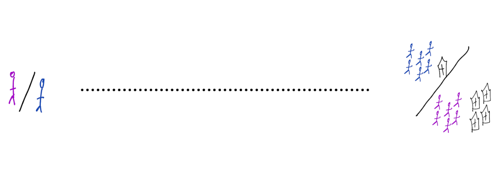

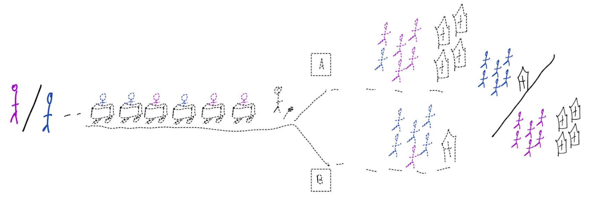{.fragment}

:::

\begin{align}
    E[Y|X] \class{fragment}{= E[E_{t~\sim \pi_0(X)}[Y|X,t]]}
\end{align}

## Confounded prediction models do not account for confounding

:::{.r-stack}

{.fragment}

{.fragment}

:::

## Prediction under intervention models

- When correctly estimated, decision rule "give treatment with best predicted outcome" leads to foreseeable improvements.

## Prediction modeling is very popular in medical research

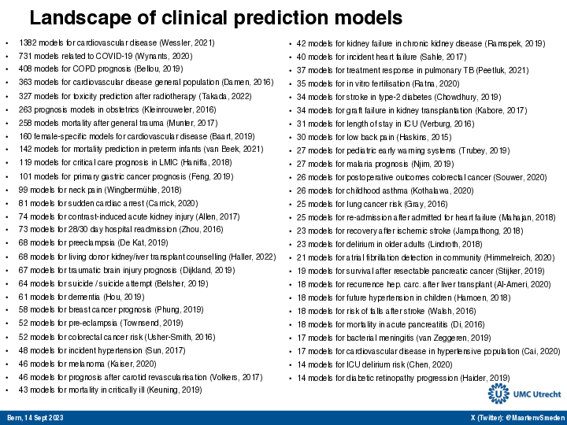{fig-align='center'}

## Recommended validation practices and reporting guidelines do not protect against harm

### because they do not evaluate the policy change

:::{.columns}

::::{.column width="50%"}

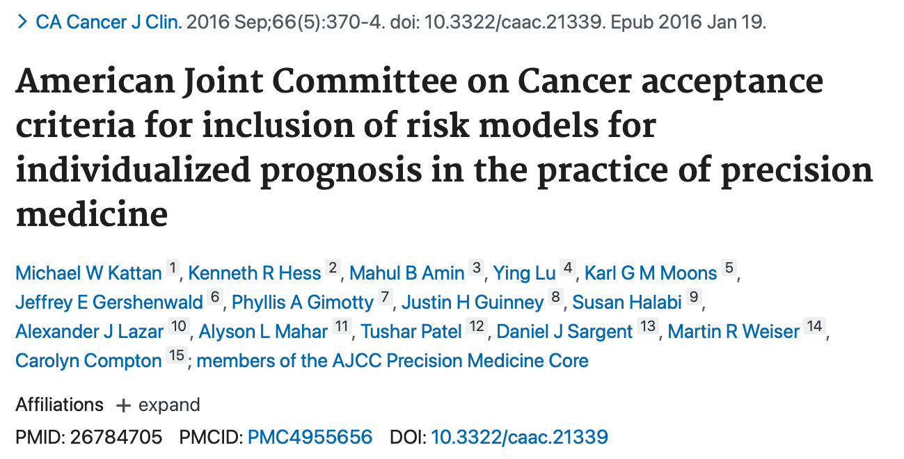{fig-align="center"}

::::

::::{.column width="50%"}

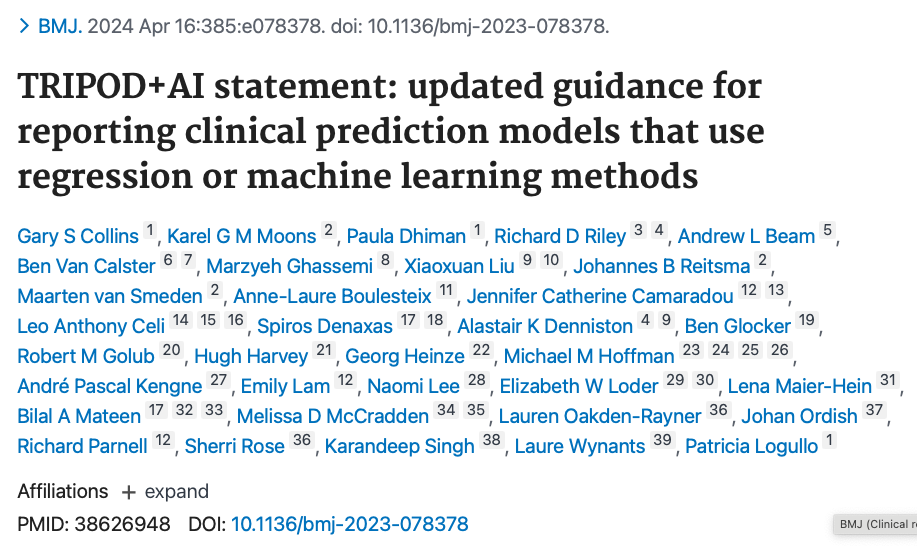{fig-align="center"}

::::

:::

## Bigger data does not protect against harmful prediction models

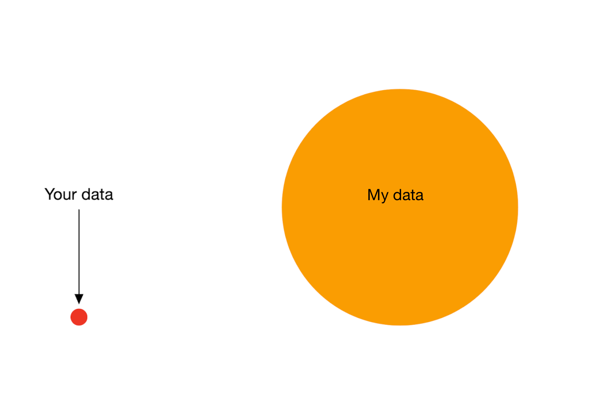{fig-align="center"}

## More flexible models do not protect against harmful prediction models

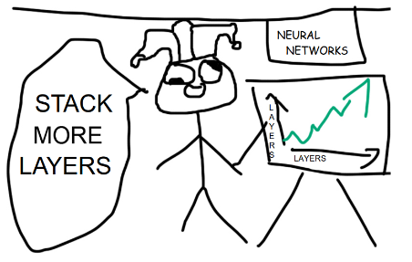{fig-align="center"}

<!-- TODO make mindthegap background image -->

---

::: {.r-stretch}

{fig-align="center"}

:::

## {auto-animate=true}

::: {style="margin-top: 200px; font-size: 3em; color: red;"}
What to do?
:::

## {auto-animate=true}

::: {style="margin-top: 100px"}
What to do?
:::

1.  Evaluate policy change (cluster randomized controlled trial)
2.  Build models that are likely to have value for decision making

# 2b. improving non-causal prediction models with causality

- interpretability
- robustness / 'spurious correlations' / generalization
- fairness
- selection bias

## Interpretability

- end-users (e.g. doctors) often want to understand *why* a prediction model returns a certain prediction
- this has two possible interpretations:
  a. explain the model (i.e. the computations)
  b. explain the world (i.e. why is this patient at high risk of a certain outcome)
- b. often has a causal connotation, though achieving this is may be unfeasible as you need causal assumptions on all covariates (rember table 2 fallacy)

## Robustness / spurious correlations / generalization

- prediction models are developed in some data, but are intended to be used elsewhere (in location, time, other)
- in causal language, shifts in distributions can be denoted as interventions on specific nodes
- prediction models that include (direct) causes may be more robust to changes as the chain between $X$ and $Y$ is shorter
- some machine learning algorithms like deep learning are very good at detecting 'background' signals, e.g.:
  - cows typically stand on grass, so a model may use the grass to predict cows
  - detect the scanner type from a CT-scanner
    - if hospital A has scanner type 1 and hospital B has scanner type 2
    - and the outcome rates differ between the hospitals, models may (mis)use the scanner type to predict the outcome
    - what will the model predict in hospital C? or when A or B buy a scanner of different type?
  - may be preventable with causality

## Fairness

- in the historic distribution, outcomes may be affected by unequal treatment of certain demographic groups
- instead of perpetuating inequities, we may want to design models that diminish them
- this means intervening in the distribution (= a causal task)
- causality has a strong vocabulary for formalizing fairness
- actually achieving fairness is highly non-trivial, not in the least part due to unclear definitions
- chosing to not include sensitive attributes in a prediction model is often not gauranteed to improve fairness

## Selection bias

- have samples from some selected subpopulation
  - university hospital
  - older men
- want to generalize to another subpopulation
  - general practitioner
  - younger women
- use DAGs to express the difference between source and target population
- calculate e.g. expected performance on target population with techniques like importance sampling

## Wrap-up

- predictions can have causal interpretations
- prediction-under-intervention: causal with respect to treatment (not covariates)
- mis-use of non-causal models for causal tasks (e.g. prediction model for treatment decisions) is perilous
  - always think about the policy change and its effect on outcomes
- evaluate policy changes with cluster RCTs, or historic RCTs and importance sampling
- causal thinking may improve other aspects of non-causal prediction models such as robustness, fairness, generalization

## Proof of importance sampling unbiasedness{#sec-is .nonincremental}

assuming $x$ is discrete, otherwise replace sums with integrals for continuous $x$

want to compute the expected value of $g(x)$ over distribution $p$, but we have samples from another distribution $x \sim q$

$$E_{x \sim q} \left[ \frac{p(x)}{q(x)} g(x) \right] = \sum_x q(x) \left( \frac{p(x)}{q(x)} g(x) \right) = \sum_x p(x) g(x) = E_{x \sim p} \left[g(x) \right]$$

this assumes $q(x)>0$ whenever $p(x)>0$ for the ratio $p/q$ to be defined

## References
